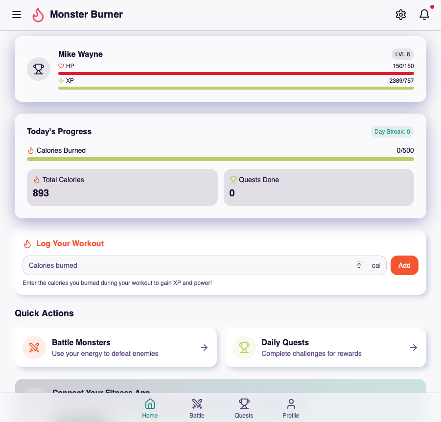

# Monster Burner: Fitness RPG



Monster Burner is an interactive fitness RPG that transforms your real-world exercise into in-game progress. Burn calories in real life to defeat monsters, complete quests, and level up your character!

## Features

### 🔥 Calorie to Game Power System

Convert your real-world exercise effort into game power:
- Each calorie you burn gives you energy in the game
- 25 calories = 1 HP damage against monsters
- Track your daily progress toward fitness goals
- Maintain a streak for additional rewards

### ⚔️ Battle System

Engage in tactical battles against various monsters:
- Choose opponents of different difficulty levels
- Use your burned calories to power attacks
- Experience variable attack types (Max Effort, Normal, Minimal, Missed)
- Defeat boss monsters for bonus rewards and quest completion

### 📈 Progress Tracking

Monitor your fitness journey within an engaging RPG context:
- Daily and total calorie counters
- Streak tracking for consistent exercise
- Character level progression with improved stats
- XP system that rewards consistent activity

### 🎯 Quest System

Complete fitness-themed challenges:
- Daily quests to encourage regular exercise
- Boss battles that require strategic calorie management
- Rewards that enhance your character's abilities

### 🌓 Personalization

Make the game your own:
- Light/dark theme options
- Character customization
- Adjustable daily calorie goals

## Getting Started

### Prerequisites

- Node.js & npm - [install with nvm](https://github.com/nvm-sh/nvm#installing-and-updating)

### Installation

```sh
# Clone the repository
git clone <YOUR_REPOSITORY_URL>

# Navigate to the project directory
cd monster-burner

# Install dependencies
npm install

# Start the development server
npm run dev
```

## How to Play

1. **Track Your Exercise**: Enter the calories you burn from real-world exercise
2. **Battle Monsters**: Use your calories to power attacks against monsters
3. **Complete Quests**: Fulfill daily fitness challenges to earn rewards
4. **Level Up**: As you defeat monsters and complete quests, your character grows stronger

### Tips for Success

- **Consistent Activity**: Maintain a streak by logging calories daily
- **Strategic Battles**: Save calories for boss battles to maximize rewards
- **Balanced Approach**: Mix regular exercise with challenging boss fights

## Technical Details

Monster Burner is built with modern web technologies:

- **React**: For building the user interface
- **TypeScript**: For type-safe code
- **Tailwind CSS**: For responsive and elegant styling
- **Shadcn UI**: For beautiful UI components
- **React Router**: For seamless navigation
- **React Query**: For efficient data management
- **Local Storage**: For saving game progress

## Project Structure

```
src/
├── components/        # UI components
│   ├── game/          # Game-specific components
│   ├── layout/        # Layout components
│   └── ui/            # Shadcn UI components
├── context/           # React context for game state
├── hooks/             # Custom React hooks
├── lib/               # Utility functions
└── pages/             # Main application pages
```

## Contributing

We welcome contributions to enhance Monster Burner! Feel free to submit issues or pull requests.

## License

This project is licensed under the MIT License - see the LICENSE file for details.

## Acknowledgments

- Fitness enthusiasts who inspired this gamified approach to exercise
- The amazing open-source community behind the technologies used
- All contributors who help improve the game

---

Built with ♥ for fitness and gaming enthusiasts

